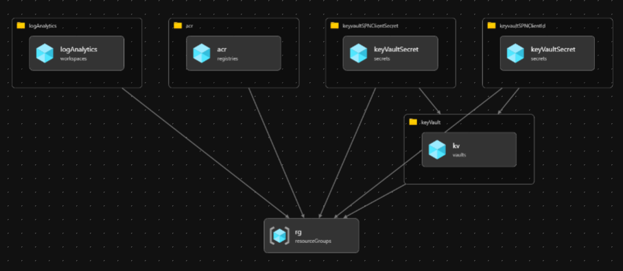

[[_TOC_]]

# Design Principles

These design principles drive the decisions around the features and architecture of the orchestration tooling. Understanding the design principles is helpful for understanding the intended usage of the tool.

There are some instances where additional use cases will be defined in future and the tooling will need to be updated to accommodate those use cases.

## Everything-as-Code - Automated

The orchestrator is following the common [principles of DevOps](https://docs.microsoft.com/en-us/azure/architecture/checklist/dev-ops).

We place an emphasis on infrastructure-as-code (IaC) following a declarative approach. This principle is extended to policy and process (i.e., gated release process). Anything that can be managed through code, should be managed in code. This is what is meant by everything-as-code.

The declarative model means that the code describes a desired state and that some run-time is responsible for interpreting the code and establishing the desire state. A declarative approach is contrasted against an imperative or procedural approach. An imperative approach provides a set of steps to execute and a desired state can only be infer (at best) from the steps. Azure Resource Manager templates/Bicep are being used in a declarative approach while PowerShell is used for the imperative side of the tool.

Automation is a third pillar along with everything-as-code and the declarative approach. Any change of state should be initiated as a change to source code. The change in source code triggers an automated process, that includes validation and safety checks. This allows for more predictable outcomes and reduces the risk of human error. Anything that can be automated, should be automated.

## Common tools for automation and manual process

Any automation should follow the same steps and use the same tools that a developer would use manually. For example, a CI/CD pipeline in Azure DevOps should invoke the same commands that a human being would use when deploying manually. By having common tools and procedures, outcomes are more predictable.

# Orchestration Architecture

# Orchestration process

## Bicep

ARM templates/bicep modules are used for deploying the initial infrastructure and setting up appropriate permissions. The redeployment of these infrastructure resources are idempotent and should be deployable anytime.

The bicep modules are located in the `bicep` folder of the repository root. The following resources are deployed as part of the infrastructure automation:

- **Key Vault** - Used for storing Service Principal Client ID and secret
- **Container registry** - Creates the actual container registry for managing the lifecycle of your base images
- **Log Analytics** - For diagnostic logging

## PowerShell

Orchestration is possible with the help of PowerShell. Scripts have been developed to deploy the bicep modules and aid in the image build and deployment process. PowerShell classes and interface are used as a blueprint to instantiate various objects at run time. There are two main PowerShell scripts at work here:

### ARMDeploymentService.ps1

Located in the `orchestration\integrationService` folder, is used for the following:

- Deploying/validating the Bicep templates
- Clean up of environment
- Remove resource locks (if any)

### AzureContainerService.ps1

Located in the `orchestration\containerService` folder, is used for the following:

- Configuring container repository
- Creating the base images
- Set up ACR task for automating build, test and patching life cycle
- Deleting ACR tasks
- Deleting the container registry

### Other scripts

- **ImportModules.ps1** - Helps import all required modules for local development
- **Helper.psm1** - Helper functions for various activities
